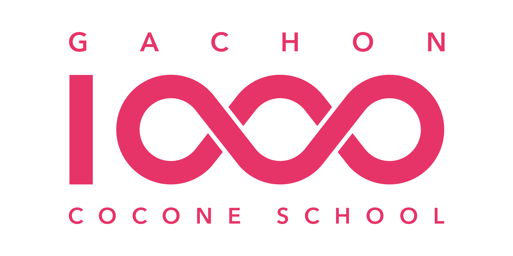

# 🔴⚪ 포켓몬스터 × 우리 팀



> **오박사:** “자네, 어떤 팀을 선택하겠나?”  
> 몬스터볼을 클릭하고 우리 팀의 도감을 확인해 보세요.

<p align="center">
  <a href="#team-dex" title="팀 도감으로 이동">
    <strong>🔴⚪ 몬스터볼을 클릭해 팀 도감 열기</strong>
  </a>
</p>

---

## 🎒 오박사의 제안

우리 팀은 각자의 개성과 능력을 모아 하나의 프로젝트를 완성합니다.  
지금부터 팀원들의 타입과 특성을 소개하겠습니다.

<details>
<summary>몬스터볼을 열기 전에 읽어 보기</summary>

1. 팀원 사진과 이름을 확인합니다.
2. 각 팀원의 포켓몬 타입과 역할을 살펴봅니다.
3. 팀이 해결하려는 문제와 프로젝트 목표를 확인합니다.

</details>

<a id="team-dex"></a>

## 📖 우리 팀 도감

<!-- 팀 사진을 추가하면 아래 '📸 사진을 추가하세요' 부분을 이미지 코드로 바꾸세요. -->

| 도감 번호 | 팀원 | 포켓몬 타입 | 특성 | 프로젝트 역할 |
| :---: | :---: | :---: | :--- | :--- |
| No.0001 | 📸 사진을 추가하세요<br>**팀원 1** | 🔥 불꽃 | 아이디어가 풍부함 | 기획 |
| No.0002 | 📸 사진을 추가하세요<br>**팀원 2** | ⚡ 전기 | 빠르게 실행함 | 개발 |
| No.0003 | 📸 사진을 추가하세요<br>**팀원 3** | 🌿 풀 | 꼼꼼하게 다듬음 | 디자인 |

### 팀 사진 넣는 방법

팀 사진 파일을 이 저장소에 넣은 뒤 아래 코드를 원하는 위치에 붙여 넣으세요.

```markdown

```

팀원별 사진은 아래처럼 넣을 수 있습니다.

```markdown

```

## 🧭 프로젝트 소개

### 우리가 해결하려는 문제

여기에 팀이 발견한 문제와 해결하고 싶은 이유를 작성하세요.

### 우리가 만들고 있는 것

여기에 프로젝트의 핵심 기능과 기대 효과를 작성하세요.

### 프로젝트 진행 상황

- [ ] 아이디어 정리
- [ ] 역할 분담
- [ ] 첫 번째 화면 제작
- [ ] 팀원 피드백 반영
- [ ] 최종 페이지 공개

## 🔗 바로가기

- [가천대학교 홈페이지](https://www.gachon.ac.kr)
- [GitHub 저장소](https://github.com/hanyoungmin13/tut01)

<p align="center">
  <a href="#-포켓몬스터--우리-팀">⬆️ 몬스터볼 화면으로 돌아가기</a>
</p>
